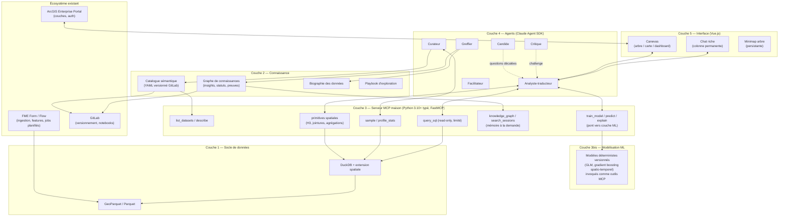
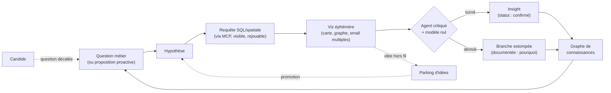
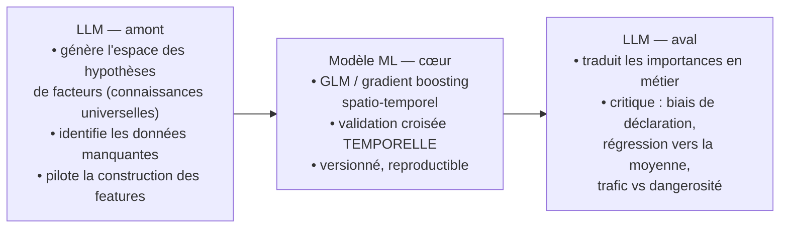
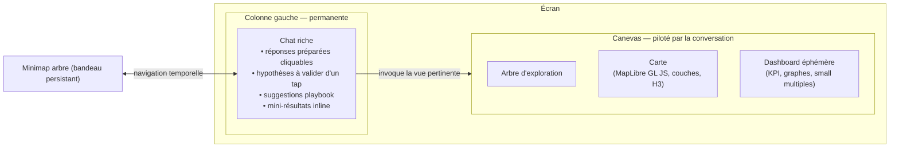
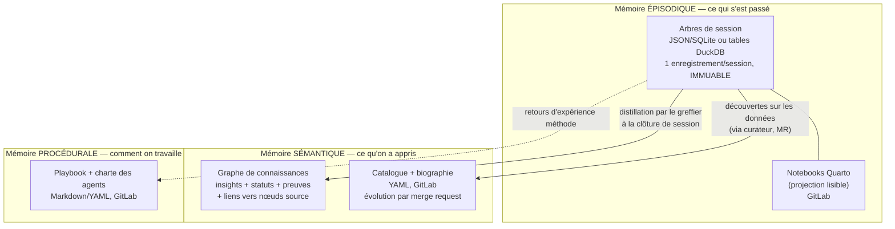

# intreepid — Vision architecturale (v0.3)

> **Objet** : workspace de découverte analytique (exploration de données géospatiales ou non en dialogue avec des agents LLM).
> **Statut** : proposition pour validation — aucune implémentation engagée.
> **Nom de code** : `intreepid` (provisoire — nom définitif en suspens, cf. Q-0001 du spec ; candidats pressentis : *Semantree*, *Semantrek*).
> **Date** : 2026-07-25 (session de fondation).

## Historique des versions

| Version | Date | Modifications |
|---------|------|---------------|
| v0.1 | 2026-07-25 | Vision initiale : couches, boucle de découverte, charte des agents, arbre-carte, collaboration, périmètre v1/v2 |
| v0.2 | 2026-07-25 | Ajouts : rôle **curateur**, outil **`profile_stats`**, **couche modélisation ML** + cas pilote accidents, principe **P9**, **modèle de persistance de la mémoire** |
| v0.3 | 2026-07-27 | Ajouts : **scoutisme de données** (extension du mandat du curateur, §4.3), **scénario de référence « départ à froid »** (§5), **test de visibilité de la plus-value** en v1 (§12) + risque associé (§13) |

---

## 1. Vision

Un espace de travail agentique où un ou plusieurs humains explorent des données
(géospatiales ou non) en dialogue avec des agents LLM, pour découvrir des
informations **non triviales** et prendre des décisions fondées sur des
connaissances nouvelles.

### Le vrai plus (vs outils classiques, vs démos IA)

Trois capacités **impossibles sans LLM**, qui définissent la raison d'être de
la solution :

1. **Documentation à coût zéro** — le greffier capture tout le raisonnement
   (hypothèses, requêtes, résultats, abandons *et leurs raisons*) pendant que
   les humains restent concentrés sur la découverte.
2. **Capitalisation systémique** — chaque session laisse le système plus
   intelligent : sur les données (biographie), sur le domaine (graphe de
   connaissances), sur la méthode (playbook). Les outils classiques
   redémarrent de zéro à chaque fois.
3. **Rigueur architecturée** — agents critique et candide, modèles nuls,
   traçabilité complète : chaque insight doit survivre à la contradiction
   avant d'être retenu.

### Le rôle des LLM (posture fondatrice)

Les LLM sont là pour **aider, orienter, challenger, imaginer, proposer,
corriger, réorienter** — jamais pour remplacer le calcul déterministe ni le
jugement métier. Ils s'adaptent et évoluent par les expériences auxquelles
ils sont confrontés (voir P9 et §10).

### Anti-objectifs

- Pas une démo à effet WOW sans valeur durable.
- Pas un chatbot devant une base de données.
- Pas une réinvention de la BI classique — on s'y **adosse**, on ne la
  remplace pas.

---

## 2. Principes directeurs

| # | Principe | Conséquence concrète |
|---|----------|----------------------|
| P1 | Le LLM ne "voit" pas la géométrie | Feature engineering spatial déterministe en amont (FME, H3, jointures) |
| P2 | Le LLM n'ingère jamais les données brutes | Accès par outils MCP : profils statistiques, agrégats, échantillons |
| P3 | Read-only strict | Le workspace ne modifie jamais les données sources |
| P4 | Tout est rejouable | Chaque insight est lié aux requêtes SQL qui le prouvent |
| P5 | Chaque session enrichit le système | Greffier/curateur → catalogue, graphe, biographie, playbook |
| P6 | Honnêteté des agents | Incertitude chiffrée, "je ne sais pas" autorisé, jamais de validation par complaisance |
| P7 | Simplicité d'abord | S'appuyer sur l'agentique et MCP plutôt que sur de la plomberie applicative lourde |
| P8 | Confidentialité | Données sensibles hors périmètre ou pseudonymisées en amont (FME) |
| **P9** | **Les agents apprennent par leur contexte, pas par leurs poids** | Pas de ré-entraînement : le contexte de travail s'enrichit (catalogue, graphe, biographie, playbook, charte). Un agent frais hérite instantanément de tout ce que ses prédécesseurs ont appris |

---

## 3. Architecture en couches



### Détail des couches

**C1 — Socle de données.** Tout converge vers GeoParquet/Parquet (FME assure
l'ingestion depuis n'importe quelle source). DuckDB + extension spatiale est
le moteur de requête unique — la *lingua franca* entre pipelines et agents.

**C2 — Connaissance.** Voir §4 (catalogue sémantique) et §10 (persistance).

**C3 — Serveur MCP maison.** Python 3.10+ fortement typé (FastMCP).
Read-only strict, limites de volumétrie, requêtes toujours visibles et
rejouables. Outil central : `profile_stats` (§4.2).

**C3bis — Modélisation ML.** Voir §7.

**C4 — Agents.** Construits sur le Claude Agent SDK (boucle agentique,
outils MCP, sessions persistantes). Voir charte §6.

**C5 — Interface.** Application Vue.js (squelette applicatif type PUMA :
Vue.js + Portal + OAuth). Voir §8.

---

## 4. Le catalogue sémantique et sa curation

### 4.1 Structure

Un fichier YAML par dataset, versionné dans GitLab. L'agent qui appelle
`describe(dataset)` reçoit une **fiche de connaissance**, pas un schéma
technique :

```yaml
dataset: accidents_route
titre: Accidents de la circulation avec dommages corporels
source: OFROU (open data), points depuis 2011
maj: annuelle (mars, pour l'année N-1)
srid: EPSG:2056
granularite: 1 ligne = 1 accident géolocalisé

colonnes:
  accident_type:
    type: code
    sens: type de collision (tamponnement, perte de maîtrise...)
    valeurs: {at0: dérapage, at1: dépassement}
  severity:
    sens: gravité la plus élevée parmi les impliqués
    piege: "un accident 'léger' peut impliquer plusieurs blessés"
  road_type:
    sens: type de route selon classification OFROU
    piege: "les routes communales sont sous-représentées avant 2015"

limites_connues:            # alimenté par la biographie des données
  - "Seuls les accidents AVEC dommages corporels déclarés à la police
     sont présents → biais de déclaration variable selon gravité et lieu."
  - "Précision de géolocalisation : GPS depuis 2016, adresse avant."

relations:
  - vers: reseau_routier_ofrou
    cle: jointure spatiale (snap 10m)
    perte: "~2% des points ne s'accrochent à aucun tronçon"
  - vers: trafic_moyen_journalier
    sens: "indispensable pour normaliser — un comptage brut d'accidents
           mesure surtout le volume de trafic"

questions_deja_explorees:   # alimenté par le graphe de connaissances
  - "corrélation météo/gravité : testée 2026-06, non significative
     après contrôle du trafic (session #12)"
```

La qualité des découvertes est directement proportionnelle à la richesse de
cette couche : l'agent sait *d'emblée* les pièges, les biais et les
questions déjà tranchées.

### 4.2 `profile_stats` — le profil statistique comme proxy des données

Application du principe P2 poussé à son terme : le LLM ne lit jamais les
lignes, il lit une **carte d'identité statistique** calculée par DuckDB en
secondes. Par type de colonne :

| Type | Statistiques calculées |
|------|------------------------|
| Numérique | min/max/moyenne/médiane, quantiles (p5, p25, p75, p95), écart-type, skewness, taux de nulls et de zéros, outliers > 3σ |
| Catégorielle | cardinalité, top-10 valeurs + fréquences, taux d'unicité (détecte les identifiants déguisés), entropie |
| Temporelle | bornes, trous de série, saisonnalité grossière, ruptures de volume (les changements de collecte se *voient*) |
| Spatiale | emprise, densité par région, distance au plus proche voisin, taux de géométries invalides |
| Croisée (à la demande) | matrice de corrélation, tables de contingence, profils conditionnels |

Exemple du mécanisme — pour `vitesse_limite`, l'agent reçoit :

```
valeurs: {50: 42%, 80: 31%, 30: 12%, 60: 8%, 120: 4%, null: 2.8%, 999: 0.2%}
```

Ses connaissances universelles s'activent sans avoir lu une ligne : `999`
est un code sentinelle non documenté ; l'absence de zones 20 est suspecte
en contexte urbain ; les 2.8% de nulls doivent être qualifiés (aléatoires
ou concentrés → biais). Le calcul déterministe fournit les **faits**, le
LLM fournit le **regard** qui sait ce qui est bizarre.

### 4.3 Le curateur — la curation dans le workflow

Le catalogue vit dans le workflow, pas comme une corvée de documentation.
Le **curateur** (nouveau rôle, charte §6) opère à trois moments :

**En amont de l'amont (scoutisme de données)** : quand une question métier
arrive sans données correspondantes dans le socle, le curateur ne s'arrête
pas à « dataset introuvable ». Il mobilise les connaissances universelles du
LLM pour identifier les sources existantes susceptibles de couvrir le besoin
(opendata.swiss, geo.admin.ch, OFS, portails cantonaux…), évalue leur
pertinence (couverture, granularité, fraîcheur, conditions d'accès) et
propose un **plan d'acquisition** — l'ingestion effective restant du ressort
de FME et de la validation humaine (P3, P8). Le catalogue peut ainsi
s'enrichir d'une fiche *pressentie* (source, limites anticipées, statut
« non ingéré ») avant même l'arrivée des données. Cette capacité est la
condition du scénario « départ à froid » (§5).

**En amont (ingestion)** : profiling automatique du nouveau dataset
(`profile_stats`), rédaction d'un *brouillon* de fiche, puis **interview de
l'humain** sur ce que le profiling ne peut pas deviner ("que signifient les
4 valeurs de `severity` ? ruptures de collecte connues ?"). Dix minutes de
dialogue remplacent des heures de documentation.

**Pendant la découverte** : quand la réalité contredit la fiche (jointure
qui perd 8% au lieu des 2% documentés), le curateur ne corrige pas
silencieusement — il ouvre une **proposition de correction** (merge request
GitLab sur le YAML) validée par l'humain. Le catalogue reste sous contrôle
humain, à coût d'entretien quasi nul.

---

## 5. La boucle de découverte



Mécanismes clés de session :
- **Session = arbre, pas ligne** : branches, bifurcations, impasses visibles.
- **Parking d'idées** : garer une idée d'un mot sans dérailler ; revue en fin
  de session (multi-contributeurs, attribuées).
- **Modèles nuls** : avant de retenir un pattern spatial, générer le
  contrefactuel aléatoire. Pas distinguable du bruit → mort.
- **Deux artefacts de sortie** : trace brute exhaustive + notebook curaté
  (Quarto/Jupyter) avec SQL rejouable et narratif — *produit* de session,
  pas espace de travail.
- **Découverte proactive** : jobs FME Flow planifiés qui profilent, détectent
  dérives/anomalies et ouvrent des *questions* ; re-tests automatiques des
  insights confirmés (péremption).

### Scénario de référence — le départ à froid

> Cas d'usage étalon : il démontre la capacité la plus contre-intuitive du
> système — produire de la valeur **avant même qu'une donnée soit ingérée** —
> et exerce le scoutisme de données (§4.3), l'honnêteté (P6) et le critique.

**Situation** : un utilisateur non expert arrive avec un besoin flou et aucune
donnée dans le socle. Exemple étalon : *« je cherche un terrain à bâtir dont
la situation laisse présager une forte progression de valeur »*.

La boucle procède alors par approximations successives :

1. **Structurer la question (zéro donnée nécessaire).** Les connaissances
   universelles du LLM (économie urbaine, marché foncier) génèrent l'espace
   des facteurs : accessibilité (temps de trajet aux centres d'emploi,
   gares), projets d'infrastructure annoncés, dynamique démographique,
   rareté de la zone à bâtir, fiscalité communale, nuisances et exposition,
   statut au plan d'affectation. L'utilisateur seul n'en aurait listé que
   deux ou trois — cette décomposition est déjà un résultat.
2. **Trier le faisable (scoutisme, §4.3).** Le curateur identifie les
   sources existantes et leur accessibilité réelle — zones à bâtir
   harmonisées (ARE), temps de trajet (geo.admin.ch / CFF), projets PRODES,
   démographie et charge fiscale (OFS) — et annonce d'emblée ce qui
   manquera (prix de transaction parcellaires difficiles d'accès → proxys).
3. **Livrer le demi-résultat honnête.** Le livrable n'est **pas** une
   prédiction de plus-value (personne ne sait faire, et P6 interdit de le
   prétendre) : c'est une **grille de scoring multicritère spatialisée** —
   shortlist de zones, incertitude affichée, carte des angles morts, plan
   d'acquisition des données manquantes. Transposition directe du cadrage
   du cas accidents (§7) : « carte pour prioriser », jamais « prédiction ».

Le **demi-résultat est un livrable de première classe**, pas un échec faute
de données : l'utilisateur repart avec une grille de critères qu'il n'aurait
jamais construite seul, et chaque itération (donnée acquise, hypothèse
testée) enrichit la suivante — c'est la boucle de découverte elle-même,
amorcée à vide. Le critique veille au piège spécifique du domaine :
confondre « les prix ont monté » avec « les prix vont monter » (régression
vers la moyenne).

---

## 6. Charte des agents

> Livrable à part entière, versionné dans GitLab. La charte elle-même évolue
> par retour d'expérience (P9).

| Agent | Mandat | Interdits | Règles d'honnêteté |
|-------|--------|-----------|--------------------|
| **Analyste-traducteur** | Traduire métier ↔ SQL/spatial, conduire l'exploration, choisir la vue pertinente, orchestrer la couche ML | Modifier les données ; affirmer sans requête-preuve | Incertitude chiffrée ; SQL toujours affiché |
| **Critique** | Démolir les découvertes : corrélations fallacieuses, Simpson, biais, MAUP, régression vers la moyenne | Challenger tout en permanence (**proportionnalité** : choisir ses combats) | Expliciter le mécanisme du doute, pas juste "douteux" |
| **Candide** | Questions naïves/décalées à intervalles réguliers ; ouvrir des voies latérales | Se substituer au critique | Assumer la naïveté sans la déguiser en expertise |
| **Greffier** | Capturer hypothèses, requêtes, résultats, abandons + raisons ; empreintes spatiales des nœuds ; distiller vers graphe et biographie à la clôture | Interrompre le flow ; trier à chaud | Fidélité à ce qui a été dit, attribution exacte |
| **Curateur** | Scouter les sources externes quand les données manquent (plan d'acquisition), profiler les nouveaux datasets, rédiger les brouillons de fiches, interviewer l'humain, proposer les corrections du catalogue (merge requests) | Modifier le catalogue sans validation humaine ; déclencher une ingestion sans validation | Distinguer fait mesuré / interprétation / question ouverte ; qualifier l'accessibilité réelle d'une source pressentie |
| **Facilitateur** (sessions à plusieurs) | Sérialiser les contributions, relancer les silencieux, transformer les désaccords en hypothèses testables | Arbitrer sur le fond | Neutralité entre participants |

---

## 7. Couche modélisation ML

### Division du travail

Le LLM **ne prédit pas** — la prédiction est le rôle de modèles ML
classiques, déterministes et versionnés, invoqués comme des outils MCP
(`train_model`, `predict`, `explain`) — jamais une boîte noire dans le chat.



### Cas pilote pressenti : risque d'accidents de la circulation

**Cadrage honnête** : on ne prédit pas *où* les accidents auront lieu
(événements rares, largement stochastiques) — on produit une **carte de
probabilité de risque par tronçon / maille H3**, avec facteurs explicatifs,
pour **prioriser les aménagements**. La nuance sépare l'outil crédible de
la démo démolissable.

Pourquoi ce pilote est quasi idéal :
- Données OFROU ouvertes et géolocalisées depuis 2011.
- Couches de contexte sur geo.admin.ch (réseau routier, trafic, limites de
  vitesse, pentes) — écosystème maîtrisé.
- Destinataire métier réel, décisions à la clé.
- Tout le workflow s'y exerce : catalogue, curateur, hypothèses du candide,
  modèles nuls, arbre-carte, couche ML.

Pièges spécifiques que le critique doit couvrir : biais de déclaration
(seuls les accidents déclarés sont visibles), régression vers la moyenne
(un pic local redescend probablement seul — piège classique de la fausse
efficacité d'aménagement), apprendre "où il y a du trafic" au lieu de
"où c'est dangereux" (normalisation par le trafic indispensable).

### Note technique : la maille H3

Grille hexagonale hiérarchique (standard d'analyse spatiale, origine Uber) :
16 résolutions emboîtées, en pratique résolutions 7–10 (~1.2 km à ~65 m).
Trois atouts : voisins équidistants (contrairement aux carrés), identifiant
texte par cellule (agrégation = simple `GROUP BY` DuckDB, sans jointure
géométrique), et hiérarchie multi-échelle = **arme anti-MAUP** (un pattern
robuste tient à toutes les résolutions ; un pattern qui n'existe qu'à une
seule est probablement un artefact du découpage).

---

## 8. Interface

### Agencement



- **Le chat pilote le canevas** : l'agent choisit la vue comme il choisit ses
  mots. Pas de cockpit figé en grille.
- **Viz éphémère** générée à la volée pour la question du moment ; les
  insights validés se matérialisent en BI persistante
  (Evidence.dev / Superset — BI-as-code, aligné GitLab).
- **Vues liées (linked brushing)** : lasso sur la carte ↔ sélection sur le
  scatter ↔ filtrage de l'arbre.
- **Incertitude comme couche affichable** sur toute carte (issue de la
  biographie des données).

### Le couplage arbre ↔ carte (la signature)

Chaque nœud de l'arbre porte une **empreinte spatiale** capturée par le
greffier. Arbre et carte deviennent deux projections du même objet : le
raisonnement.

- Survol d'une branche → son emprise s'illumine sur la carte.
- Lasso sur la carte → l'arbre filtre les branches ayant touché la zone
  ("qu'a-t-on déjà testé *ici* ?").
- **Zones blanches du raisonnement** : le territoire jamais visité par
  aucune branche — générateur automatique de questions naïves.
- Vocabulaire visuel minimal : forme = type de nœud, couleur = statut,
  épaisseur = solidité de la preuve. Les branches mortes **s'estompent**
  (sédiment visible), ne disparaissent pas.
- **Sémantique du zoom** (anti-hairball) : de loin, branches maîtresses et
  insights confirmés ; le détail apparaît en zoomant — comportement de
  carte, instinctif pour des utilisateurs SIG.
- **Mode replay** : rejouer la session en accéléré (reprise, onboarding,
  transmission).
- Empreintes floues acceptées : représentation dégradée
  (emprise exacte → communes touchées → canton) ; nœuds a-spatiaux autorisés.

---

## 9. Collaboration multi-utilisateurs

- Chacun interagit **depuis son propre appareil** sur la même session.
- **L'agent comme point de sérialisation** : toutes les contributions passent
  par la conversation — pas de co-édition temps réel (pas de CRDT/websockets
  de synchronisation d'état), pas de conflits. Simplicité par l'agentique.
- Actions : créer une branche, repartir de la branche d'un collègue,
  critiquer/clore une branche.
- **Attribution native** : pastilles/couleurs par auteur sur nœuds, idées du
  parking et validations. Décision structurante dès la v1 (coût zéro
  maintenant, rétrofit très cher).
- Le notebook de sortie documente *qui a validé quoi* — traçabilité de
  gouvernance (contexte décisionnel public).
- Deux modes d'usage : **synchrone léger** (salle, écran partagé, un pilote —
  aucun dev supplémentaire) et **asynchrone** (annotations sur le notebook →
  graphe de connaissances).

---

## 10. Modèle de persistance de la mémoire

La mémoire du système est **distillée en trois étages** — l'arbre n'est pas
la mémoire tout court, il en est l'étage brut.



| Étage | Contenu | Format / lieu | Mutabilité |
|-------|---------|---------------|------------|
| Épisodique | Arbres : nœuds, bifurcations, requêtes, résultats, abandons, attribution, empreintes spatiales | JSON/SQLite ou DuckDB dédié ; notebook Quarto dans GitLab | **Immuable** une fois la session close (archive) |
| Sémantique | Insights (cycle de vie, preuves, attribution) ; fiches datasets enrichies | Graphe + YAML dans GitLab | Évolutive, sous contrôle humain (MR), traçable jusqu'au nœud source |
| Procédurale | Coups analytiques éprouvés, règles des agents | Markdown/YAML dans GitLab | Évolutive par retour d'expérience |

**Chargement paresseux** : au démarrage d'une session, l'agent ne charge
*pas* tout — il reçoit le catalogue des datasets concernés, les insights
actifs liés au sujet, et l'état de la dernière session ouverte (hypothèses
en cours, parking non traité). Le reste est accessible **à la demande** via
MCP : `search_knowledge(...)` interroge le graphe, `search_sessions(...)`
fouille les arbres passés.

> Analogie : l'arbre est le **journal de bord**, le graphe et le catalogue
> sont **l'encyclopédie** qu'on en tire, le playbook est le **manuel de
> méthode**. On ne relit pas ses journaux de bord pour savoir ce qu'on
> sait — mais on peut toujours y retourner pour vérifier *d'où* on le sait.

---

## 11. Intégration à l'écosystème

| Système | Rôle | Sens |
|---------|------|------|
| **FME Form / Flow** | Ingestion → Parquet, feature engineering spatial, jobs proactifs, re-tests planifiés | amont + périodique |
| **ArcGIS Enterprise Portal** | Couches de référence, géotraitements, authentification | consommé par le canevas |
| **ArcGIS Pro** | Atelier de production cartographique — **pas** l'hôte du workspace | export en un clic (couche Portal / GeoParquet) ; add-in léger éventuel en v2+ |
| **GitLab** | Versionnement : catalogue, charte, notebooks, BI-as-code, playbook | bidirectionnel |
| **swisstopo / geo.admin.ch** | Référentiels et couches fédérales (MCP existant) | consommé |

**Décision** : pas d'intégration native ArcGIS Pro en v1 (stack .NET hors
périmètre, UI contrainte, adhérence licence/poste incompatible avec le
multi-participants). Le besoin réel — rester connecté à l'écosystème SIG —
est couvert par le Portal et l'export.

---

## 12. Périmètre

### v1 — Noyau minimal (prouver la valeur)

1. Socle DuckDB + GeoParquet (ingestion FME)
2. Catalogue sémantique (premier registre YAML) + **curateur** (profiling
   `profile_stats` + interview d'ingestion)
3. Serveur MCP read-only (list/describe/query/sample/`profile_stats` +
   primitives spatiales de base)
4. Agent analyste + **greffier** (trace brute + arbre de session en données,
   persistance épisodique)
5. Interface : chat riche + canevas avec **une** viz éphémère (carte
   MapLibre + graphes simples)
6. Notebook de sortie généré (Quarto)
7. Attribution des contributions (structure de données prête, même en
   mono-utilisateur)

### v2 — Extensions (dans l'ordre de valeur pressenti)

1. Arbre visuel interactif + minimap (le greffier v1 a déjà produit les données)
2. Couplage arbre ↔ carte (empreintes spatiales, zones blanches)
3. Agents critique et candide comme rôles distincts
4. Graphe de connaissances requêtable + cycle de vie/péremption des insights
5. **Couche modélisation ML** (`train_model`/`predict`/`explain`) — pilote
   accidents
6. Multi-utilisateurs sérialisé par l'agent
7. Biographie des données automatisée (curateur en continu), **scoutisme de
   données outillé** (recherche de sources en session, fiches pressenties),
   playbook, découverte proactive (FME Flow)
8. Linked brushing complet, small multiples, BI persistante (Evidence.dev)
9. Recherche sémantique cross-datasets (embeddings sur catalogue)

> **Règle d'admission d'un composant** : il doit soit *accélérer l'itération*,
> soit *solidifier la connaissance*. Sinon, il n'entre pas.

> **Test de visibilité de la plus-value (v1)** : la boucle « question →
> SQL → viz » est aujourd'hui commoditisée (un client LLM générique branché
> sur un serveur MCP DuckDB la fournit). Chaque livrable v1 doit donc
> répondre à la question : *« qu'est-ce que cette configuration générique
> n'obtiendrait pas ? »*. La plus-value vit dans la trace (greffier), la
> mémoire (catalogue, capitalisation) et la rigueur — elle doit être
> **perceptible dès la v1**, pas promise pour la v2.

---

## 13. Risques et points de vigilance

| Risque | Impact | Mitigation |
|--------|--------|------------|
| **Fiabilité sous le seuil de confiance** (cause d'échec n°1 des outils IA en contexte spécialiste) | Abandon silencieux des utilisateurs | Read-only, SQL visible/rejouable, incertitude chiffrée, critique + modèles nuls |
| **Granularité des nœuds de l'arbre** (trop fin = bruit, trop agrégé = vide) | L'arbre ne raconte rien | Le vrai défi technique : jugement LLM du greffier ; itérer sur des sessions réelles avant de figer |
| **Hairball** (>50-80 nœuds) | Arbre illisible | Sémantique du zoom dès la conception |
| **Cathédrale** (inflation de composants) | Effort dilué, rien d'abouti | Périmètre v1 strict + règle d'admission |
| **Empreintes spatiales floues** | Couplage arbre-carte trompeur | Représentation dégradée, nœuds a-spatiaux assumés |
| **Insight trivial statistiquement fort** | Effet démo sans valeur | Validation métier en session ; filtre "tout le monde le sait" |
| **Plus-value invisible en v1** (la boucle chat→SQL→viz est commoditisée) | Perçu comme "un chatbot de plus devant DuckDB" | Test de visibilité (§12) ; greffier + catalogue dès la v1 ; chaque démo montre la trace et la capitalisation, pas seulement la réponse |
| **Survente prédictive** (cas accidents) | Crédibilité démolie par le premier statisticien | Cadrage "carte de risque pour prioriser", jamais "prédiction d'accidents" ; validation temporelle ; critique sur biais de déclaration et régression vers la moyenne |
| **Catalogue qui se périme** | Agents mal informés = mauvaises découvertes | Curateur en continu, corrections par MR, `questions_deja_explorees` synchronisées avec le graphe |
| **Confidentialité** | Non-conformité | Pseudonymisation amont (FME), périmètre de données validé par dataset |

---

## 14. Prochaines étapes proposées

1. **Valider ce document** (itérations bienvenues) et trancher le nom.
2. Choisir **le jeu de données pilote** — le cas accidents (OFROU) est
   pressenti, à confirmer — et une question métier réelle pour la v1.
3. Spécifier le **schéma du catalogue sémantique** et le **modèle de données
   de l'arbre/trace** (avec attribution et empreintes spatiales) — les deux
   structures qui conditionnent tout le reste, désormais adossées au modèle
   de persistance (§10).
4. Squelette du **serveur MCP** (Python 3.10+ typé, FastMCP, DuckDB),
   `profile_stats` en premier outil.
5. Première session de découverte réelle → calibrer la granularité du
   greffier sur du vécu, pas sur de la théorie.
